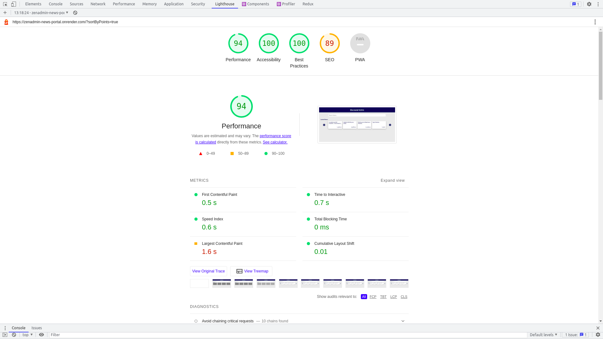

### Basic Instructions:
1. Run the following command to make a local copy of the repository:
    ``` git clone https://github.com/sscodes/weekday-job-board.git ```
2. Further instructions are in each folder's README.md files.

### Link to the website - https://zenadmin-news-portal.onrender.com/

### Features implemented in this project:

1. No CSS libraries are used, all the styling is completely custom made with BEM convention used in defining classes.
2. On the home screen, when nothing is searched for, the page shows latest news in a carousel format.
3. API based paginatation implemented on search results with pagination component completely custom built.
4. Custom debouncing applied while searching for news to improve performance and give better UX.
5. Search results are cached in session storage and go back feture is attached to news details page to let the user go back to the search results.
6. Added sorting functionality to the search results.
7. Handled error states, empty states and loading states with loaders using framer motion and skeletons wherever applicable.
8. Implemented infinite scrolling to the comment section.
9. Used Tanstack react-query for making all the query operations.
10. Synced the search query in the homepage with the URL.
11. Implemented proxy server code with express.js to by-pass CORS error thrown by browser.
12. Implemented lazy loading to reduce bundle size and hence optimize performance.
13. Used Zustand for global state management and vite as the building & scaffolding tool.

### Lightouse Report:
